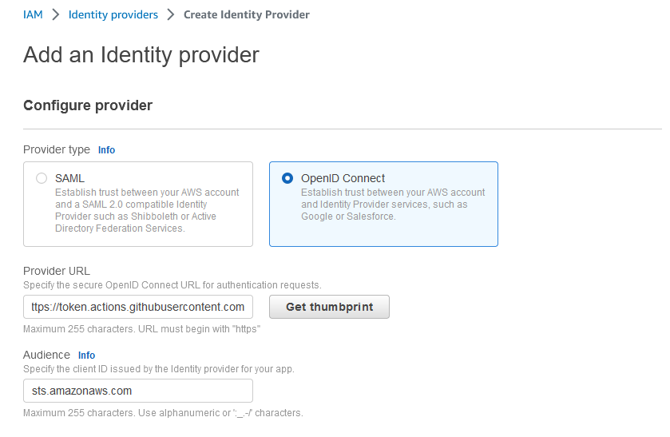

# Configure AWS credentils with OIDC token

## AWS Identity Provider Creation

```yaml
      - name: Configure AWS Credentials
        uses: aws-actions/configure-aws-credentials@v1
        with:
          role-to-assume: arn:aws:iam::123456789100:role/github-actions-role
          role-session-name: githubrolesession
          aws-region: us-east-1
```

To configure official aws credentials in GitHub Actions, Please follow below Instructions.

1. First login into AWS account and open `IAM` services
2. Select `Identity Providers` and click on `Add Provider` 
3. Fill the details as shown in the below image

```sh
provider URL: https://token.actions.githubusercontent.com
Audience: sts.amazonaws.com
```



4. Assign a IAM role to Identity Provider


```json
{
    "Version": "2012-10-17",
    "Statement": [
        {
            "Effect": "Allow",
            "Principal": {
                "Federated": "arn:aws:iam::416094998479:oidc-provider/token.actions.githubusercontent.com"
            },
            "Action": "sts:AssumeRoleWithWebIdentity",
            "Condition": {
                "StringLike": {
                    "token.actions.githubusercontent.com:sub": "repo:(GitHub_Org_Name)/*"
                },
                "StringEquals": {
                    "token.actions.githubusercontent.com:aud": "sts.amazonaws.com"
                }
            }
        }
    ]
}
```
